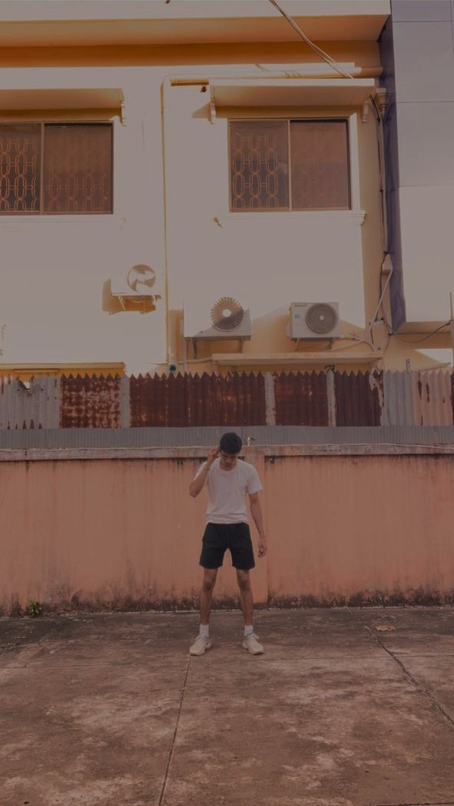

<!DOCTYPE html>
<html lang="km">

<head>
    <meta charset="UTF-8">
    <meta name="viewport" content="width=device-width, initial-scale=1.0">
    <title>Angkor Player</title>
    <!-- Font Awesome Icons -->
    <link rel="stylesheet" href="https://cdnjs.cloudflare.com/ajax/libs/font-awesome/6.4.0/css/all.min.css">
    <!-- Google Fonts -->
    <link href="https://fonts.googleapis.com/css2?family=Poppins:wght@300;400;600;800;900&display=swap"
        rel="stylesheet">

    
</head>

<body>

    <!-- 
      កន្លែងដាក់ឯកសារវីដេអូ ឬចម្រៀងរបស់អ្នក 
      សូមប្តូរ video.mp4 ទៅជាឈ្មោះឯកសារដែលអ្នកបានទាញយកមក
    -->
    <audio id="myAudio" src="animal.mp4"></audio>

    

        <!-- Big Text Background -->
        
MUSIC DISPLAY

        <!-- Header -->
        

            

                

                    
                    
                

                

                    <i class="fa-solid fa-bars-staggered"></i>
                    ANGKOR PLAYER
                

            

            

                <i class="fa-solid fa-share-nodes"></i>
            

        

        <!-- Left Content -->
        

            <h1 class="title">PLAY.</h1>
            

                WavePlayer is a simple, but elegant music player that puts
                very little between you and your music. It operates on a tab
                structure and you can customize the tabs to use only the ones
                that you actually want.
            

            

                <i class="fa-brands fa-android"></i>
                <i class="fa-brands fa-apple"></i>
                <button class="download-btn">DOWNLOAD</button>
            

        

        <!-- Hero Girl Image -->
        

            
        

        <!-- Bottom Left Wave Decoration -->
        <svg class="bottom-wave" viewBox="0 0 200 40" fill="none" stroke="currentColor" stroke-width="2">
            <path d="M0,20 Q10,5 20,20 T40,20 T60,20 T80,5 T100,20 T120,35 T140,20 T160,20 T180,5 T200,20"
                stroke="rgba(255,255,255,0.4)" fill="none" />
        </svg>

        <!-- Glassmorphism Player Bar -->
        

            

                
            

            

                
PLAYING NOW

                
SILEUK MUSIC

                
7 rings

            

            

                PREVIOUS
                <button class="btn-ctrl"><i class="fa-solid fa-backward-step"></i></button>

                <!-- ប៊ូតុង Play/Pause ដែលបានភ្ជាប់ JavaScript -->
                <button class="btn-ctrl play-btn" id="playPauseBtn">
                    <i class="fa-solid fa-play" id="playIcon"></i>
                </button>

                <button class="btn-ctrl"><i class="fa-solid fa-forward-step"></i></button>
                NEXT
            

        

        <!-- Right Side Navigation Dots -->
        

            

            

            

            

            

        

    

    <!-- JavaScript សម្រាប់បញ្ជាការ Play / Pause -->
    
</body>

</html>
